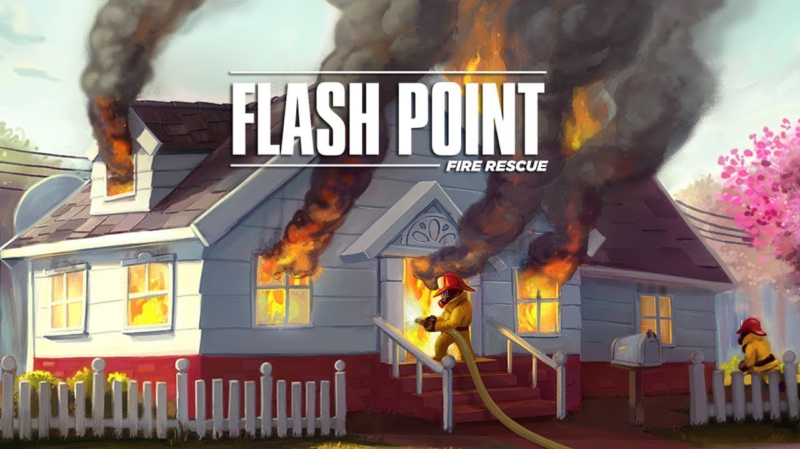

# Flash Point: Fire Rescue (In Progress, progress halted)

## Rules

The rules for the game can be found [here](./Flash_Point_Rulebook.pdf). 

## Tasks:
[Isabelle] Completely synchronize game  
[Isabelle] Connect experienced specialists to firefighters in game  
[Steven] Debug camera view  
[Steven] Write specialists scripts  
[Alex] Fix adjacency bug  
[Alex] Connect UI to game logic  
[Renato] 3D movement  
[Renato] 3D doors  
[Renato] 3D wall breaking  
[Renato] 3D board  
[Renato] 3D assets and animations  
[Renato] Synching animations  
[Renato] Game start and in game UI  
[Renato] Camera movement  
[] Firefighter knocked down during end turn fire spread  
[] Hotspots *  
[] End turn *  
[] Experienced start game: 3 explosions, 3 hazmats, 3 POI (where 1 is False Alarm), 3 additional hotspots, pick ambulance/firetruck placement  
[] Experience: Crew change  
[] Experience: choosing classes including veteran and dog  
[Priscilia] Game save Data  

\* Tasks masked with asterix means the game logic (code) is there, but not fully implemented in game. 

## Setup
### Prerequisites
* `Unity` version 2018.3.11f1 or higher
* `Microsoft Visual Studio Community 2017` version 15.9.6 or higher
* `Microsoft .NETFramework` version 4.8.03752 or higher

### Installation
* Clone the repo, navigate to the `FlashPoint` directory and run it with Unity, starting it using the StartGame scene
